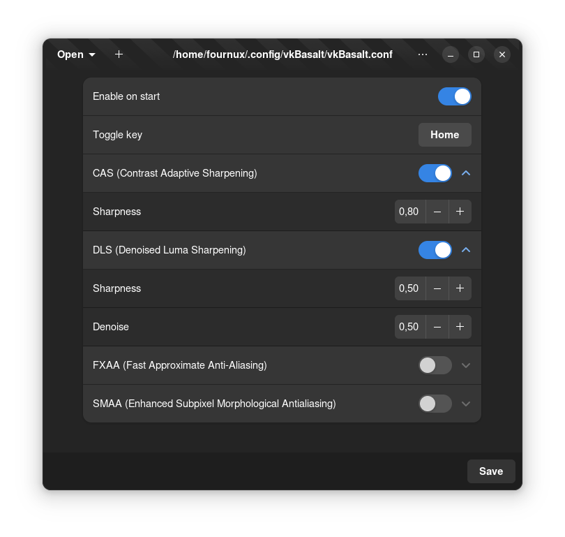

<div align="center">
  
  <h1>VkBasalt Configurator</h1>
  <p>A user interface to easily edit <a href="https://github.com/DadSchoorse/vkBasalt">vkBasalt</a> configuration files </p>
  <div>
    
    
    
    
  </div>
</div>

<div align="center">
  
</div>

## Installation

TODO

## Building

### Dependencies

You need to have **blueprint-compiler** installed on your system.

Fedora

```
sudo dnf install blueprint-compiler
```

Ubuntu & Debian

```
sudo apt install blueprint-compiler
```

To run this project, run the following command:

```bash
dotnet run
```

## Technologies used

<div>
  
  &nbsp;
  
</div>

<br>

- .NET 7
- GTK 4 (bindings from [gir.core](https://github.com/gircore/gir.core))
